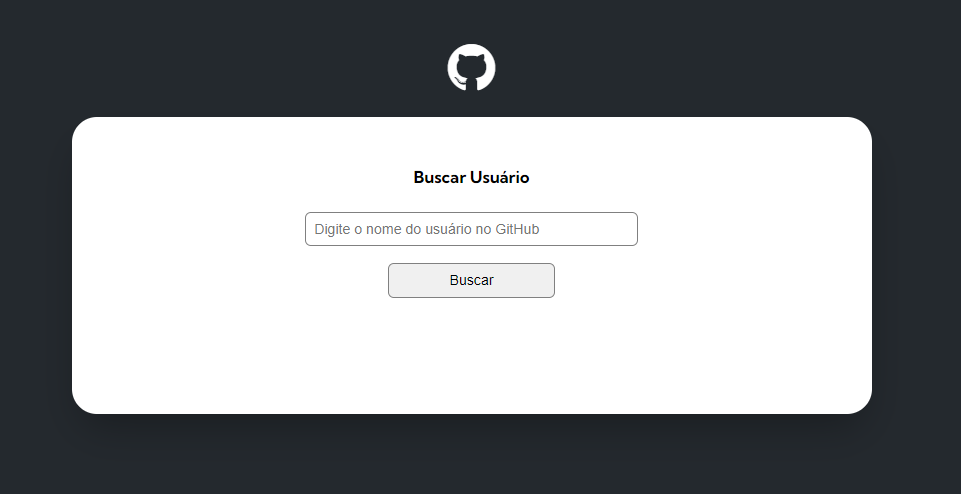
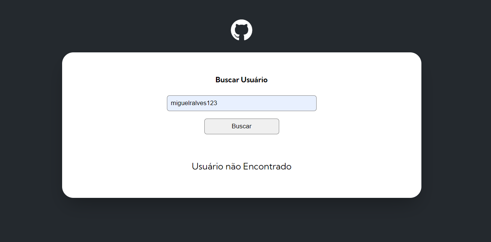
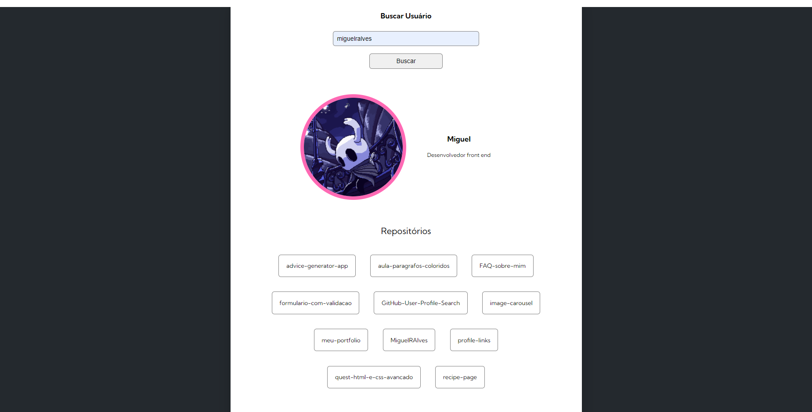

# GitHub User Profile Search

## Description

A mechanism to search for user profiles, their repositories and events by their user names.

## Screenshot

### Preview 

---

### User not Found

---

### User Found

## Built with

 - Semantic HTML Markup
 - CSS custom properties
 - JS
 - Orientation Object
 - [GitHub API](https://docs.github.com/pt/rest/quickstart?apiVersion=2022-11-28)

## Author

- Github - [MiguelRAlves](https://www.github.com/miguelralves/)
- Instagram - [@ribeiroalvess14](https://www.instagram.com/ribeiroalvess14)
- LinkedIn - [Miguel_Ribeiro_Alves](https://www.linkedin.com/in/miguel-ribeiro-alves-544879280)